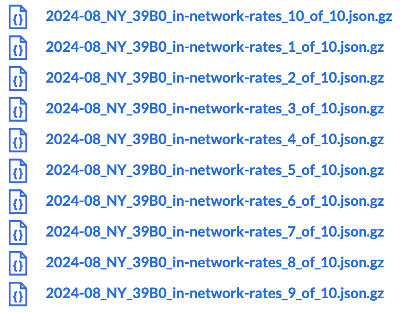
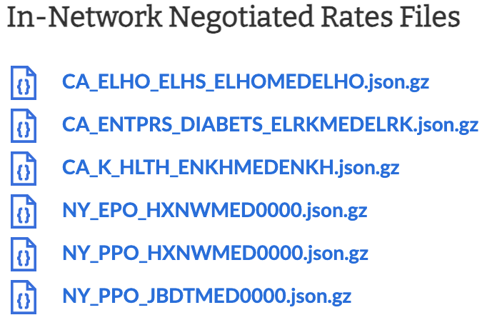

# Anthem ToC - NY PPO Network Capture

#### Time Allocation

- Coding: 4hrs
- Research: 2hrs
- Write up: 30min
- Total: 6.5hrs

Although it was recommended to keep this exercise within half a day, I chose to extend the time slightly to accommodate learning and implementing Go, as the business is transitioning to this language.

Additionally, with no prior professional experience in healthcare, I invested time in research to gain context, which I found essential to understanding the nuances of the data and BCBS. This led to a few hours beyond the recommended time.

As I continue to develop my skills in Go and gain familiarity with healthcare data, I anticipate significantly reducing the time required for similar tasks in the future.

#### Code Execution

- First Pass: 8min 55s
- Second Pass: 8min 3s

### Run Locally

---

Dependencies: Go

1. `git clone https://github.com/mccarthykp/Anthem-Parser.git`

2. `cd Anthem-Parser`

3. `go run .`

### Initial Design Choices

---

- Given such a large dataset, and presumably _MUCH_ larger datasets, processing the data as it is being streamed in makes sense here.
- Buffered writing with a package such as Bufio ensures i/o is efficient since I need to continuously write to an output file.

### First Pass

---

Based on the reporting structure outlined in [CMS' transparency in coverage repo](https://github.com/CMSgov/price-transparency-guide/tree/master/schemas/table-of-contents#reporting-structure-object), I initially filtered by `reporting_plans.plan_names(NY && PPO || New York && PPO)`, and fetched location URLs with domains in three distinct categories:

- Anthem BCBS, state-abbreviated  
  `https://anthembcbs{STATE_ABBREV}.mrf.bcbs.com/`

- Empire  
  `https://empirebcbs.mrf.bcbs.com/`

- AWS S3  
  `https://antm-pt-prod-dataz-nogbd-nophi-us-east1.s3.amazonaws.com/anthem/NY_{SOME_CODE}`

A quick search tells me Anthem operates in 14 states, all of which correspond to the Anthem BCBS state abbreviated domains.. except for NY.

1. `ca`: California  
2. `co`: Colorado  
3. `ct`: Connecticut  
4. `ga`: Georgia  
5. `in`: Indiana  
6. `ky`: Kentucky  
7. `me`: Maine  
8. `mo`: Missouri  
9. `nv`: Nevada  
10. `nh`: New Hampshire  
11. `oh`: Ohio  
12. `va`: Virginia  
13. `wi`: Wisconsin  
14. ???

Additionally, this filter produced a _significant_ volume of duplicate data.

This first pass says a few things:

- `plan_name`s are not _entirely_ helpful or seemingly accurate in this particular case, given the abundance of state abbreviated URLs, which makes me think the URLs aren't all specific to PPO plans.

- Since New York-specific PPO files are not the only files located in this filter, they could potentially be located in `reporting_plans` where the `in_network_files.descriptions` are misleading/non-descriptive.

- CareFirst, Empire, Excellus and Highmark are prevalent. To my knowledge, these are companies separate from Anthem but still under the BCBS name, and provide care to specific parts of New York. These companies each cover multiple states and multiple plans, and the associated files don’t specifically point to PPO in NY. CareFirst, Excellus and Highmark each use state-abbreviated URLs.

- The state-abbreviated URLs make me think these are out-of-area/state and/or reciprocity agreements that aren't specific to New York.

- Direct s3 domains with `anthem/NY_{SOME_CODE}` are interesting...

- I need to filter out duplicates to ensure unique entries.

### Additional Research

Entering the EIN of a few different `reporting_plan`s that included the Empire and state-abbreviated URLs showed me that those plans _sometimes_ include files still not specific to PPO plans.

Cross-referencing the repeating codes (39B0 in this case) in my output just pointed me back to the state-abbreviated domains.

I then entered the EIN of a few different `reporting_plan`s that included `anthem/NY` URLs to find _some_ files specific to NY_PPO, among many others that included EPO and various states.

The distiction I made here was that Empire and state-abbreviated URLs are most likely _always_ files related to out-of-area/state or reciprocity agreements, and while _some_ of the `anthem/NY` files can belong to non-PPO plans, these are the _only_ URLs that may contain files specific to NY-PPO plans.

### A second pass

---

Now that I know I want `anthem/NY` URLs, I can add a second filter for `in_network_files.location(anthem/NY)`. I also want to filter out duplicates. Initially I thought I could filter by `plan_id`, but recognized that many of the duplicate location URLs were actually within the same `in_network_files` field, which feels a bit underhanded, and means we need to check each URL for uniqueness.

(While not necessarily useful at the moment, I find it interesting to point out that the majority of the descriptions for these locations read `In-Network Negotiated Rates Files`. Many other locations that didn't include `anthem/NY` also had this description -- not particularly descriptive if you ask me)

The only differences in the S3 URLs are the ambiguous string in `anthem/NY_{CODE}`. The differences in the state-abbreviated URLs, aside from the states themselves, are the file path, auth parameters and `key_pair`, which I've come to find is generated on the AWS side in order to grant temporary access up to the expiration date.

### PPOs...?

---

At this point I have 50 files with varying codes. This is where I go back and grab the associated EIN and throw it in Anthem's lookup service. Interestingly enough, _some_ files have the same code but represent both PPO + EPO plans within the same file, while others only represent PPO plans etc. I have some ideas on how to approach this mentioned [here](#ein-map), but with the time constraint, this is where I ended.

### Results
---

Depending on your network connection and hardware, execution time my vary slightly. Running the script will result in the following [Output File](Anthem_NY_Filter.txt).

### Tradeoffs & Improvements

---

#### Testing

Based on the time constraints and various unknowns that come with this problem, I did not implement any tests. Having a smaller, more manageable dataset to quickly iterate on would have been useful. If I were to tackle this problem again, I'd consider taking a more test-driven development approach to include unit and integration tests that verify my filtering works as intended, I'm outputting the correct URLs, and the data pipeline functions properly.

#### Memory Optimization

Given the issue with duplication, an alternative solution that _may_ improve memory utilization is to store the unique sections of the URLs in the `seen[key]` map as hash values. As the data scales, lookups and insertions may be quicker, and storing smaller values may require less memory. Since these values are just strings, this doesn't seem like a huge benefit for this case.

#### Performance

The execution time seems relatively reasonable, but there is a case for Goroutines here. With consideration to both streaming the file and checking for duplicates in memory, filtering and decoding in parallel could increase performance as the data scales.

### Additional Features

---

#### EIN Map

The problem here is that we can't definitively isolate specific plan types to their files. It would be helpful to have some sort of map that ties known EINs to the particular code of the plans we're searching for. This would need to be regularly updated -- I'd imagine EINs belong to entities that could potentially change their plans, and the codes found in the filenames which correlate to specific plans could presumably change at any time at the whim of the reporting entity. In a script, you could cross-reference this map of EINs with the plan types you want to surface.

#### Configurable Filtering & Output Formats

- The ability to quickly adjust specific `plan_name` and `location` filtering would be useful for isolating other specific URLs under various plans or states.

- Having the option to choose how filtered data is returned would be nice -- JSON, CSV, etc.

#### Network Request Retry and other Error Handling

More granular logging, a retry for the HTTP request and a comprehensive testing infrastructure.
